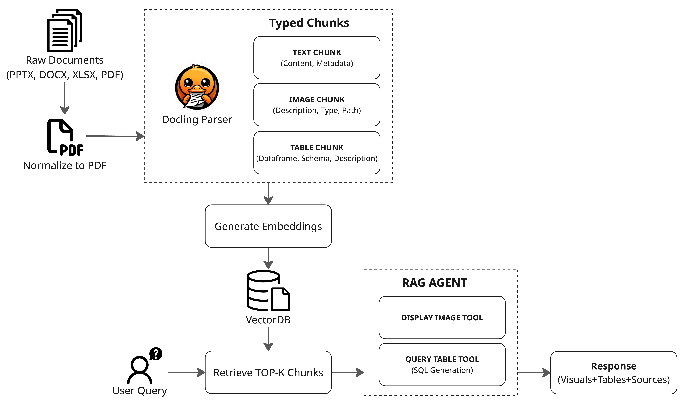

# Multimodal Document Parser

A RAG (Retrieval-Augmented Generation) agent powered by a multimodal document parser. Uses [Docling](https://github.com/DS4SD/docling) to extract text, tables, and images from PDFs, then enables natural language querying over the parsed content.

## Features

- **Multimodal Parsing**: Extract text, tables, and images from PDFs using Docling
- **Hybrid Chunking**: Smart text chunking that preserves document structure
- **AI Descriptions**: Auto-generate descriptions for images and tables using Gemini
- **Sequential Image Naming**: Images saved as `filename_image_1.png`, `filename_image_2.png`, etc.
- **Default Image Storage**: Extracted images saved to `data/images/` directory
- **Typed Chunks**: Pydantic models for TextChunk, TableChunk, and ImageChunk
- **Vector Indexing**: Store typed chunks in vectorDB for semantic search
- **RAG Agent**: Query documents with tool-calling capabilities:
  - Synthesize answers from multiple text chunks
  - Display relevant images inline
  - Query tables with SQL (supports filtering, aggregations, joins)

## Installation

```bash
python -m venv venv
source venv/bin/activate  # On Windows: venv\Scripts\activate
pip install -r requirements.txt
```

## Configuration

Create a `.env` file:

```
GOOGLE_API_KEY=your_api_key_here
```

## Models Used

- **LLM**: `gemini-2.5-pro` (RAG agent, table descriptions, image descriptions)
- **Embeddings**: `gemini-embedding-2`

## Quick Start

### 1. Parse and Index Documents

```python
from multimodal_parser import DocumentIndexer

indexer = DocumentIndexer(qdrant_path="./qdrant_data")
indexer.index_folder("./data/files")  # Index all PDFs in folder
indexer.close()
```

### 2. Query with RAG Agent

```python
from multimodal_parser import RAGAgent

agent = RAGAgent(qdrant_path="./qdrant_data")

# Text query
result = agent.query("What is the main topic?")
print(result["answer"])

# Image query - agent displays relevant images
result = agent.query("Show me the architecture diagram")

# Table query - agent generates SQL to extract data
result = agent.query("Which model has the highest score?")

agent.close()
```

### 3. Run Test Script

```bash
python tests/test_agent.py
```

Generates an HTML report at `tests/test_outputs/response.html` with answers, images, and table results.

## Project Structure

```
multimodal_parser/
├── chunk_models.py    # Pydantic models: TextChunk, TableChunk, ImageChunk
├── docling_parser.py  # PDF parsing with Docling + hybrid chunking
├── indexer.py         # Qdrant vector indexing
├── agent.py           # RAG agent with tool calling
├── model_manager.py   # LLM and embedding management
└── demo.ipynb         # Interactive demo
```

## How It Works



1. **Parse**: `DoclingParser` extracts content into typed chunks with AI-generated descriptions
   - Images are saved to `data/images/` with sequential naming: `document_image_1.png`, `document_image_2.png`, etc.
   - Tables converted to pandas DataFrames with AI-generated searchable descriptions
   - Text chunks preserve document structure and headings
2. **Index**: `DocumentIndexer` embeds chunks and stores in Qdrant vector database
3. **Query**: `RAGAgent` retrieves relevant chunks and uses tools to formulate answers
   - `display_image` tool: Shows relevant images inline with `[IMAGE:X]` placeholders
   - `query_table` tool: Executes SQL queries on table data for numerical analysis

---

## Customization

### Use Your Own Data

Simply point the indexer to your PDF folder:

```python
indexer = DocumentIndexer(qdrant_path="./my_db")
indexer.index_folder("./path/to/your/pdfs")
```

### Use DoclingParser Directly

For custom parsing pipelines, use `DoclingParser` to extract chunks:

```python
from multimodal_parser import DoclingParser, ChunkType

parser = DoclingParser()
chunks = parser.parse("document.pdf")

# Chunks are typed: TextChunk, TableChunk, ImageChunk
for chunk in chunks:
    if chunk.chunk_type == ChunkType.TEXT:
        print(chunk.content)
    elif chunk.chunk_type == ChunkType.TABLE:
        print(chunk.dataframe)  # pandas DataFrame
    elif chunk.chunk_type == ChunkType.IMAGE:
        print(chunk.image_path)  # saved image file
        print(chunk.content)     # AI-generated description
```

### Plug Your Own Vector Database

Replace Qdrant with your preferred vector store. The key interface:

```python
# 1. Embed chunks
from multimodal_parser.model_manager import ModelManager

model = ModelManager()
embeddings = model.embeddings.embed_documents([chunk.content for chunk in chunks])

# 2. Store in your database
for chunk, embedding in zip(chunks, embeddings):
    your_db.insert(
        vector=embedding,
        payload=chunk.model_dump()  # Pydantic model -> dict
    )

# 3. Search
query_embedding = model.embeddings.embed_query("your question")
results = your_db.search(query_embedding, limit=5)
```

### Swap the LLM

Update `model_manager.py` to use a different LLM provider:

```python
# Example: Use OpenAI instead of Gemini
from langchain_openai import ChatOpenAI, OpenAIEmbeddings

self._llm = ChatOpenAI(model="gpt-4")
self._embeddings = OpenAIEmbeddings()
```
